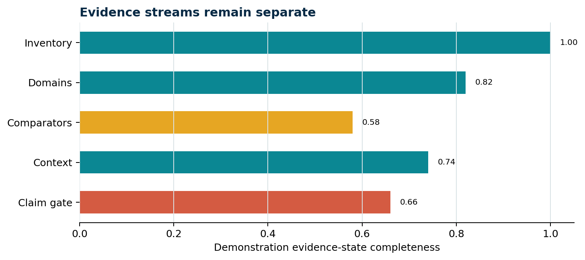
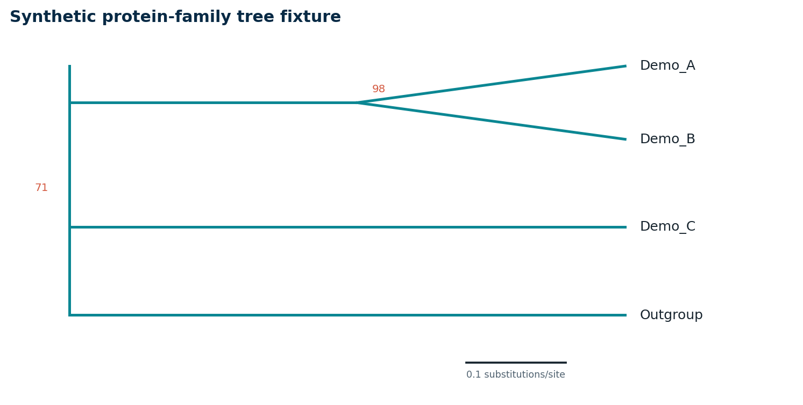

# Executive interpretation

This synthetic report tests whether the same governed Markdown renders coherently in Word and PDF. Values and names are fabricated and must not be treated as biological evidence.

> [CAUTION] Demonstration data
> The plots exercise layout, caption, and provenance behavior only. They do not represent a Sapote-Mamey run.

## Evidence-stream summary

<!-- sapote:figure id=evidence_streams layout=full -->

**Caption:** Five synthetic evidence streams are displayed separately rather than compressed into a biological verdict.
**Methods:** Deterministic demonstration values rendered as a horizontal bar chart with fixed colors and axis limits.
**Source:** Locally generated synthetic fixture; build_fixture_images.py.

<!-- sapote:table id=evidence_table layout=portrait repeat_header=true widths=2,1.2,3.4 -->
| Stream | Fixture state | Interpretation boundary |
|---|---|---|
| Inventory | Complete | Confirms fixture rows only |
| Domains | Partial | Supports no enzyme-family conclusion |
| Comparators | Staged | Missing cells remain workflow gaps |
| Context | Demonstration | No ecological function is inferred |

## Protein-family tree presentation

<!-- sapote:figure id=tree_fixture layout=full -->

**Caption:** Synthetic topology demonstrates the placement of support labels, terminal names, and a scale bar.
**Methods:** Hand-constructed fixture coordinates; values are not calculated from sequences and are not a phylogenetic analysis.
**Source:** Locally generated synthetic fixture; build_fixture_images.py.

> [HOLD] Interpretation intentionally withheld
> A real tree requires an exact sequence roster, alignment method, trimming policy, model, rooting rule, support definition, and source manifest before any placement language is admissible.

## Evaluation questions

- Are figure images readable at ordinary page zoom?
- Does every figure retain its caption, methods, and source line?
- Do table headers repeat and remain associated with their body rows?
- Are the claim ceiling and page number visible without dominating the page?

