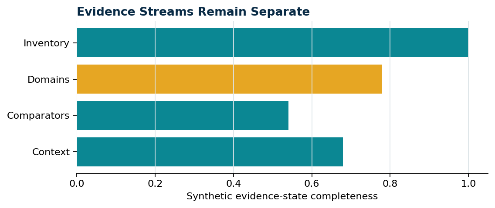

# {{topic}}

This synthetic report tests a reusable figure-rich body without repeating document metadata.

> [CAUTION] Demonstration only
> Values are fabricated and support no biological conclusion.

## Evidence summary

<!-- sapote:figure id=evidence layout=full -->

**Caption:** {{caption}}
**Methods:** Fixed synthetic values rendered locally for document-layout testing.
**Source:** Token-light pilot fixture generated by build_pilot_inputs.py.

## Reader decision

{{decision}}
