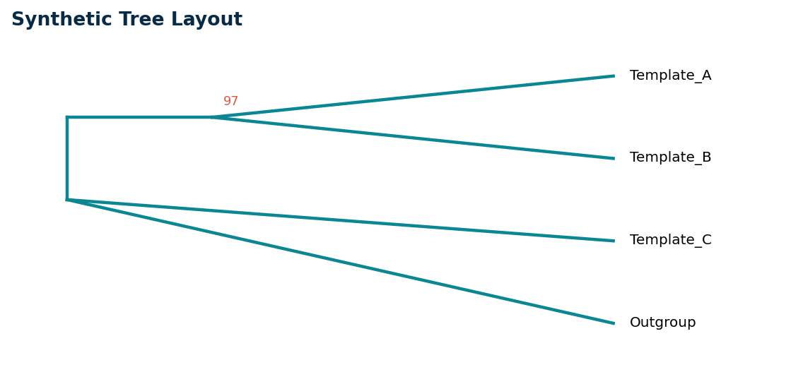

# Tree Presentation Pilot

The tree is treated as a governed scientific figure rather than an uncaptioned decoration.

<!-- sapote:figure id=tree layout=full -->

**Caption:** Synthetic topology used only to test terminal labels, support text, and scale-aware placement.
**Methods:** Hand-constructed coordinates; no sequences, alignment, model, or inference were used.
**Source:** Token-light pilot fixture generated by build_pilot_inputs.py.

> [HOLD] Interpretation withheld
> A real tree requires an exact sequence roster, alignment, trimming, model, rooting, support definition, and source manifest.
